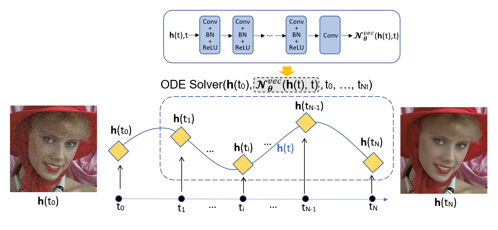

# NODE-ImgNet: a PDE-informed effective and robust model for image denoising

This repository serves as the official test implementation of my paper, which has been preprinted on arXiv. 

- Xie, X., Wu, Y., Ni, H. and He, C., 2023. [NODE-ImgNet: a PDE-informed effective and robust model for image denoising.](
https://doi.org/10.48550/arXiv.2305.11049) arXiv preprint arXiv:2305.11049.

The provided code in this repository corresponds to the concepts and methodologies described in the paper.

## Network architecture

# Running Codes

Requirements for a successful implementation of the codes can be found in `requirements.txt`.

### Training datasets
The training dataset of Gaussian noisy is downloaded at https://drive.google.com/file/d/120ZYtOgHpXJc3jfkdTFa0KzhsJQAEKiK/view?usp=share_link

After downloading, place the folder in the ./data/GaussianTrainingData/ directory.

## Commands
Below are some example commands for training or testing NODE-ImgNet:
#### Training NODE-ImgNet for gray Gaussian noisy images with &sigma; = 25
`python gaussian_gray_denoising.py --noise_level 25`
#### Training NODE-ImgNet for color Gaussian noisy images with &sigma; = 25
`python gaussian_color_denoising.py --noise_level 25`
#### Training NODE-ImgNet-B (Blind) for gray Gaussian noisy images
`python gaussian_gray_denoising.py --is_blind`
#### Training NODE-ImgNet-B (Blind) for color Gaussian noisy images
`python gaussian_color_denoising.py --is_blind`

If you want to cite this paper, please refer to the following format
1. Xie, X., Wu, Y., Ni, H. and He, C., 2023. NODE-ImgNet: a PDE-informed effective and robust model for image denoising. arXiv preprint arXiv:2305.11049.

2. @article{xie2023node,

   title={NODE-ImgNet: a PDE-informed effective and robust model for image denoising},

   author={Xie, Xinheng and Wu, Yue and Ni, Hao and He, Cuiyu},

   journal={arXiv preprint arXiv:2305.11049},

   year={2023}
   }

